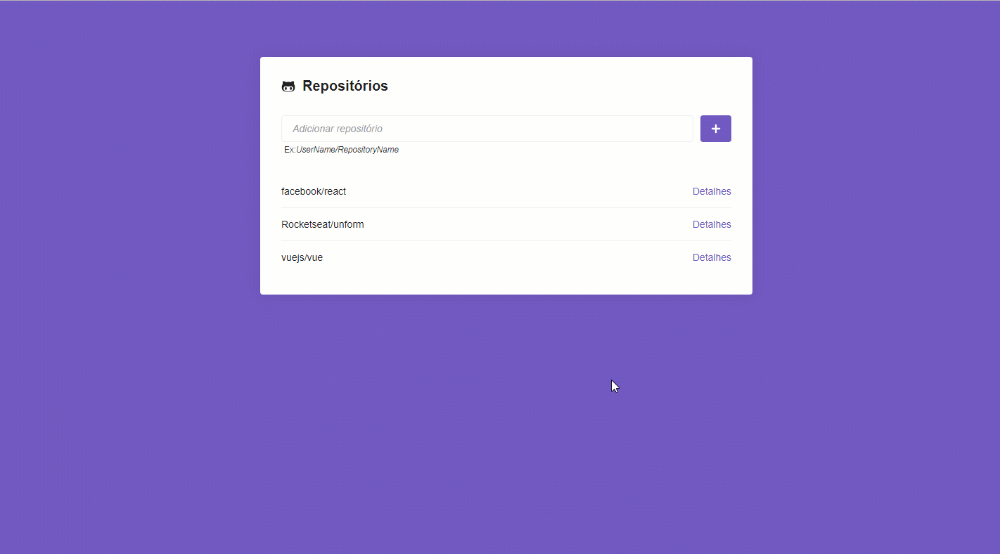

# Desafio 05. Aplicação com ReactJS

Rocketseat BootCamp ReactJs - Módulo de Busca de Repositórios e issues no GitHub através da API.

- Adicionar novas funcionalidades na aplicação.

## Funcionalidades

### Captando erros

Adicionar um `try/catch` por volta do código presente na função `handleSubmit` presente no componente `Main` e caso um repositório não seja encontrado na API do Github adicionar uma borda vermelha por volta do input em que o usuário digitou o nome do repositório.

### Repositório duplicado

Antes de fazer a chamada à API na função `handleSubmit` fazer uma verificação para ver se o repositório não está duplicado, ou seja, se ele ainda não existe no estado de `repositories`.

Caso exista, disparar um erro, e com isso o código cairá no `catch` do `try/catch` criado na funcionalidade anterior.

```js
throw new Error('Repositório duplicado');
```

### Filtro de estado

Adicionar um filtro de estado na listagem de Issues que foi criado no detalhe do repositório. O estado representa se a issue está em aberto, fechada ou uma opção para exibir todas.

Exemplos de requisição:

```
https://api.github.com/repos/rocketseat/unform/issues?state=all
https://api.github.com/repos/rocketseat/unform/issues?state=open
https://api.github.com/repos/rocketseat/unform/issues?state=closed
```

Documentação de apoio [nesse link](https://developer.github.com/v3/issues/#parameters-1);

### Paginação

Adicionar paginação nas issues listadas no detalhe do repositório. A API do Github lista no máximo 30 issues por página e realizar o controle do número da página atual por um parâmetro no endereço da requisição:

```
https://api.github.com/repos/rocketseat/unform/issues?page=2
```

Adicionar apenas um botão de próxima página e página anteior. O botão de página anterior deve ficar desativado na primeira página.

### Desafio Finalizado - Tela da Aplicação


